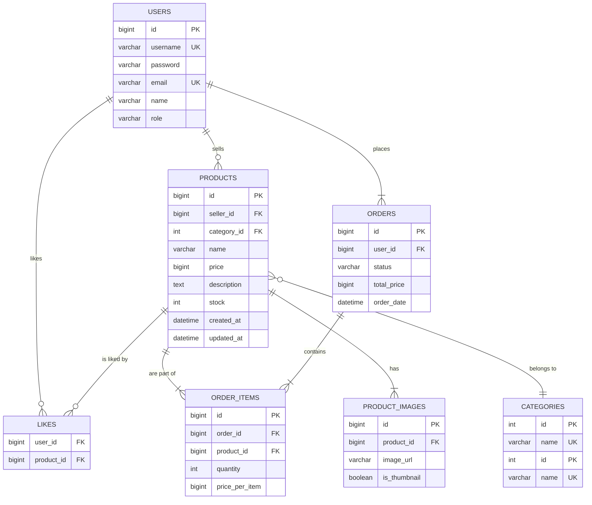

# CoreTrader

A personal e-commerce platform for computer parts, built with Spring Boot and Thymeleaf. This project serves as a learning ground for modern backend development practices.

## ✨ Features

-   **User Management**: Secure user registration and authentication.
-   **Product Catalog**: Dynamic product listing, searching, and sorting.
-   **RESTful API**: A clean API for client-side interactions (e.g., AJAX).
-   **Upcoming**: Shopping Cart, Order Management, Product Reviews.

## 🛠️ Tech Stack

-   **Backend**: Java 21, Spring Boot 3.5.4, Spring Data JPA, Spring MVC, Lombok
-   **Frontend**: Thymeleaf, Bootstrap 5, JavaScript (Vanilla JS & jQuery for AJAX)
-   **Database**: MySQL
-   **Build Tool**: Maven

## 🗄️ Database Schema (ERD)

The database is designed to be scalable, separating concerns for users, products, orders, and more.



# 🚀 Getting Started

Follow these instructions to get the project up and running on your local machine.

## Prerequisites
- **JDK 21**
- **Maven 3.8+**
- **MySQL Server**

---

## Installation & Setup

### 1. Clone the repository
```bash
git clone https://github.com/your-username/ecommerce-project.git
cd ecommerce-project
```

### 2. Database Setup

Connect to your **MySQL server**.

Create the database schema:

```sql
CREATE SCHEMA IF NOT EXISTS `ecproject`;
```

Run the DDL scripts provided in the project to create all the necessary tables (users, categories, products, etc). 

### 3. Configure Application

Open `src/main/resources/application.properties` and update the following properties with your MySQL username and password:

```properties
spring.datasource.username=your_mysql_username
spring.datasource.password=your_mysql_password
```

### 4. Run the Application

Run the application using Maven:

```bash
mvn spring-boot:run
```

The application will be accessible at:
👉 http://localhost:8080

